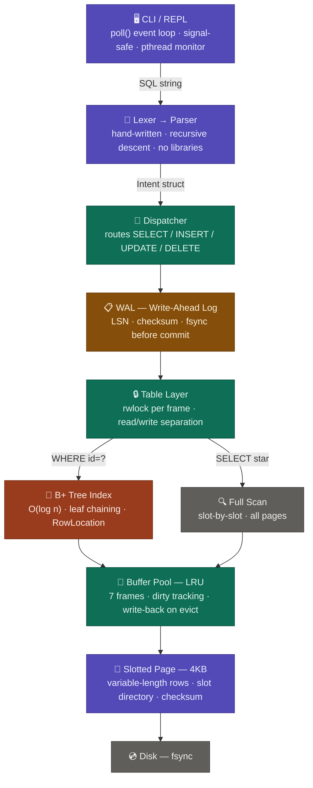

# 🛠️ KernelDB

KernelDB implements real database internals: a hand-written SQL parser, B+ Tree indexing, slotted page storage, LRU buffer pool, Write-Ahead Logging with crash recovery, and page-level concurrency — all in C17.

---

## ⚡ Key Features

- **B+ Tree Index** — O(log n) lookups with leaf node chaining for range scans
- **Slotted Page Storage** — 4KB pages with variable-length record support
- **LRU Buffer Pool** — dirty page tracking and write-back to disk
- **Write-Ahead Logging** — LSN-based WAL with `fsync()` on commit and crash recovery
- **SQL Parser** — hand-written lexer + recursive descent parser, zero dependencies
- **Concurrency** — per-frame reader-writer locks on the buffer pool
- **Signal-safe REPL** — non-blocking event loop using `poll()` with graceful shutdown

---

## 🧠 How a Query Flows Through KernelDB



---

## 🏗️ Architecture

### Layer 1 — Control Plane
- Signal-safe REPL using `poll()`
- Non-blocking event loop
- Background monitoring thread (`pthread`)
- Graceful `SIGINT` / `SIGTERM` handling

### Layer 2 — SQL Parser
- Hand-written lexer + recursive descent parser
- Converts SQL → structured `Intent`
- Supports: `SELECT`, `INSERT`, `UPDATE`, `DELETE`, `CREATE TABLE`, `DROP TABLE`
- No parser libraries — built from first principles

### Layer 3 — Write-Ahead Logging (WAL)
- LSN-based records with checksums
- `fsync()` enforced before commit acknowledgment
- Crash recovery: replays committed transactions, discards incomplete ones
- WAL truncation after successful checkpoint

### Layer 4 — B+ Tree Index
- Per-table index with automatic maintenance on insert / update / delete
- Node splitting with balanced tree growth
- Leaf node chaining for range scans
- O(log n) point lookups via `RowLocation` (page_id + slot_id)

### Layer 5 — Storage Engine + Buffer Pool
- Slotted page layout (4KB pages)
- Variable-length row storage with slot directory
- LRU buffer pool (7 frames per table)
- Dirty page tracking + write-back on eviction
- Page checksums for integrity

### Layer 6 — Concurrency
- Per-frame `pthread_rwlock` on buffer pool frames
- Read-write separation: multiple readers, exclusive writer
- Integrated at table layer for all read and write paths

---

## 🖥️ CLI Session

```sql
kerneldb> CREATE TABLE users (id INT, name TEXT)

kerneldb> INSERT INTO users VALUES (1, rohith)
kerneldb> INSERT INTO users VALUES (2, admin)

kerneldb> SELECT * FROM users
  2 row(s) found  [full scan]

kerneldb> SELECT * FROM users WHERE id = 1
  1 row(s) found  [index lookup]
```

---

## 📦 Build & Run

```bash
git clone https://github.com/rohiths0402/kerneldb.git
cd kerneldb
make
./kerneldb
```

**Requirements:** GCC, POSIX-compliant Linux, `make`

---

## 📁 Project Structure

```text
kerneldb/
├── main.c
├── Makefile
├── data/                  # persistent storage
└── src/
    ├── reph/              # REPL + control plane
    ├── Parser/            # lexer + recursive descent parser
    ├── dispatcher/        # execution routing
    ├── WAL/               # write-ahead logging
    ├── index/             # B+ Tree
    ├── storage/
    │   ├── buffer/        # LRU buffer pool
    │   ├── page/          # slotted page layout
    │   └── Table/         # table management
    ├── concurrency/       # reader-writer locks
    ├── monitor/           # background monitor thread
    └── common/            # shared types
```

---

## 🛠️ Tech Stack

| | |
|---|---|
| **Language** | C (C17) |
| **I/O** | POSIX (`poll`, `fsync`) |
| **Memory** | Manual allocation (`posix_memalign`) |
| **Concurrency** | `pthread_rwlock` |
| **Build** | Makefile |

---

## 🚀 Roadmap

- [ ] Page-level LSN for idempotent REDO
- [ ] Explicit `BEGIN` / `COMMIT` / `ROLLBACK` in REPL
- [ ] UNDO logs + before-image for rollback
- [ ] B+ Tree merge on delete
- [ ] Async I/O (`io_uring`)
- [ ] Query optimizer
- [ ] Isolation levels

---

## 🎯 Why KernelDB?

Most engineers use databases. Few understand what happens below the query.

KernelDB was built to go all the way down — how pages are laid out on disk, how an index finds a row in O(log n), how a WAL protects data across crashes, how a buffer pool decides what to evict. Every component written by hand, from scratch.

---

## 👨‍💻 Author

**Rohith S**

- GitHub: [github.com/rohiths0402](https://github.com/rohiths0402)
- LinkedIn: [linkedin.com/in/rohiths0402](https://linkedin.com/in/rohiths0402)
- Portfolio: [rohithsportfolio.vercel.app](https://rohithsportfolio.vercel.app)
